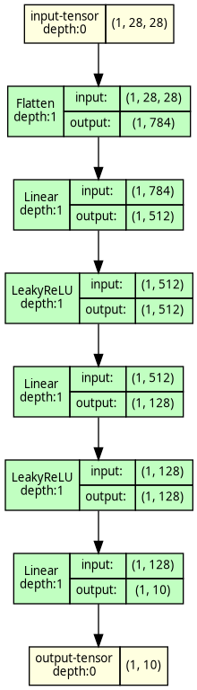
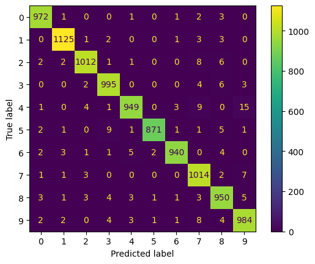

# Wprowadzenie do PyTorch

## Klasyfikacja zbiorów MNIST i Wine
### MNIST
#### Trening
Użyta architektura sieci:

```python
class MnistClassifier(nn.Module):
    def __init__(self, num_inputs, num_outputs):
        super().__init__()
        self.input_flat = nn.Flatten()
        self.input = nn.Linear(num_inputs, 512)
        self.hidden1 = nn.Linear(512, 128)
        self.output = nn.Linear(128, num_outputs)
        self.act_fn = nn.LeakyReLU()

    def forward(self, x):
        x = self.input_flat(x)
        x = self.input(x)
        x = self.act_fn(x)
        x = self.hidden1(x)
        x = self.act_fn(x)
        x = self.output(x)
        return x
```



Trening sieci przeprowadzono na 60 tys. próbek obrazów w skali szarości o rozdzielczości 28x28 pikseli. Każdy z nich przedstawiał jedną z 10 cyfr od 0 do 9 napisanych odręcznie.
Pod koniec treningu sieć osiągnęła skuteczność 99.59%.

#### Testowanie

Wytrenowaną sieć przetestowano na 10 tys. danych testowych osiągając dokładność na poziomie 98.12%.

Na rys poniżej przedstawiono macierz pomyłek dla danych testowych.




